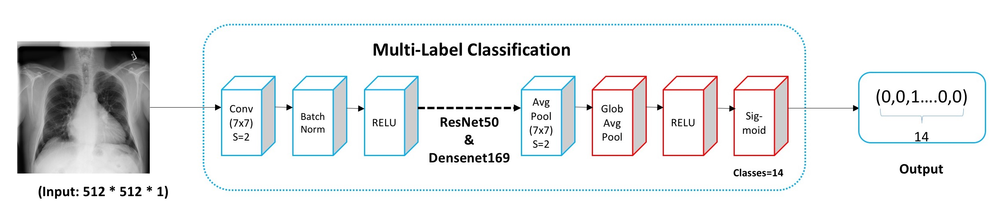
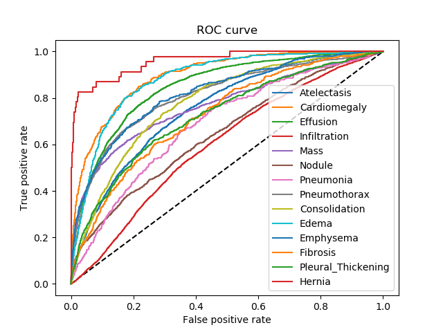
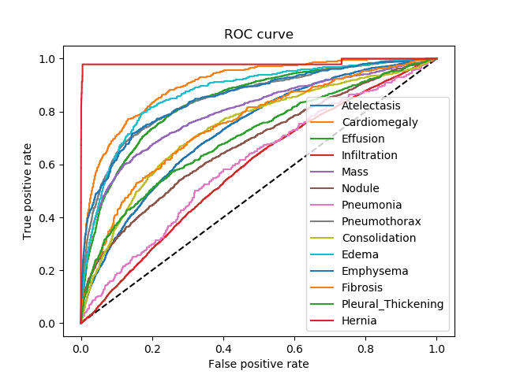

# Chest X-ray 14 Mulit-Label Classification
### In this repository we used Resnet50 and Densenet169 to classify the 14 diseases in the DR(Digital Radiography).
## Framework


## AUC Value

| Disease             |Wang et al. (2017)   | Li Yao|**Resnet50**|**Densenet169**|
|---------------------|---------------------|-------|----------|------------|
| Atelectasis         | 0.716               |0.772  |0.754     |0.729       |
| Cardiomegaly        | 0.807               |0.904  |0.896     |0.902       |
| Effusion            | 0.784               |0.859  |0.850     |0.840       |
| Infiltration        | 0.609               |0.695  |0.599     |0.586       |
| Mass                | 0.706               |0.792  |0.767     |0.798       |
| Nodule              | 0.671               |0.717  |0.647     |0.675       |
| Pneumonia           | 0.633               |0.713  |0.685     |0.603       |
| Pneumothorax        | 0.806               |0.841  |0.809     |0.850       |
| Consolidation       | 0.708               |0.788  |0.780     |0.737       |
| Edema               | 0.835               |0.882  |0.882     |0.868       |
| Emphysema           | 0.815               |0.829  |0.821     |0.852       |
| Fibrosis            | 0.769               |0.767  |0.726     |0.749       |
| Pleural_Thickening  | 0.708               |0.765  |0.724     |0.703       |
| Hernia              | 0.767               |0.914  |0.960     |0.983       |


## ROC curve
- Resnet50  
  

- Densenet169  


## Development Environment
  - python : >=2.7 (test on 2.7.13 and 3.5.3)
  - tensorflow: >=1.1.0 (test on 1.1.0 and 1.4.0)
  - keras:>=2.1.1  (test on 2.1.1 and 2.1.2)

## Training

```
1. export CUDA_VISIBLE_DEVICES=0, 1   #list num of GPU
2. python DR_Resnet50/main.py
   or python DR_Densenet169/main_dense.py
```

## Predicting

```
1. export CUDA_VISIBLE_DEVICES=0, 1   #list num of GPU
2. python DR_Resnet50/predict.py
   or python DR_Densenet169/predict_dense.py
```

## Show AUC and ROC curve
```
python AUC.py
```
## References
**[Resnet50](https://arxiv.org/abs/1512.03385):** *He K, Zhang X, Ren S, et al. Deep Residual Learning for Image Recognition[J]. 2015:770-778.*  
**[Densenet169](https://arxiv.org/abs/1608.06993):** *Huang G, Liu Z, Maaten L V D, et al. Densely Connected Convolutional Networks[J]. 2016.*  
**[Wang et al.(2017)](https://arxiv.org/abs/1705.02315):** *Li Y, Poblenz E, Dagunts D, et al. Learning to diagnose from scratch by exploiting dependencies among labels[J]. 2017.*  
**[Li Yao](https://arxiv.org/abs/1710.10501):** *Wang X, Peng Y, Lu L, et al. ChestX-ray8: Hospital-scale Chest X-ray Database and Benchmarks on Weakly-Supervised Classification and Localization of Common Thorax Diseases[J]. 2017:3462-3471.*

